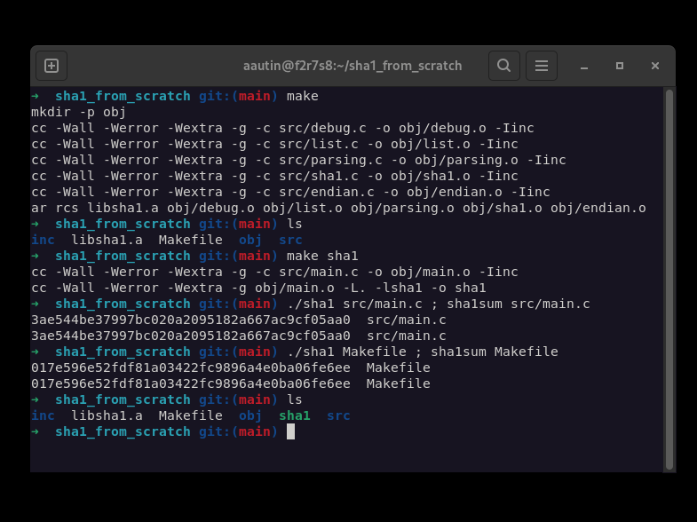
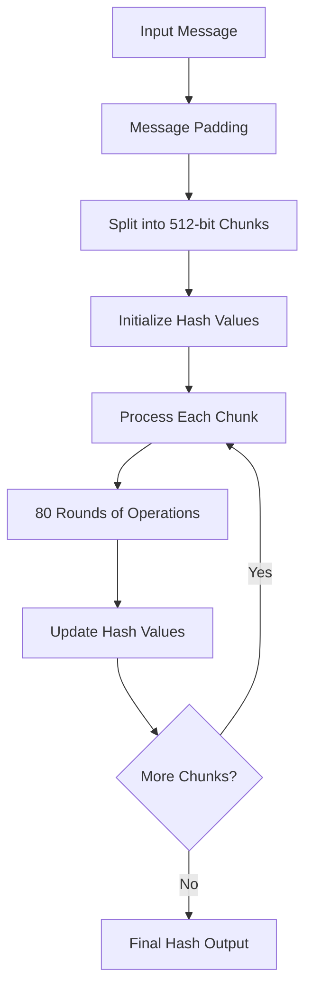

# SHA1 Implementation From Scratch

## Demo



## Algorithm Workflow



## Overview

A complete SHA-1 hash function implementation from scratch in C, following the RFC 3174 specification. This project includes message padding, chunk processing, and hash computation without relying on external cryptographic libraries.

## Features

- **Pure C Implementation**: SHA-1 algorithm implemented from the ground up
- **RFC 3174 Compliant**: Follows the official SHA-1 specification
- **Message Padding**: Proper handling of message length and padding
- **Chunk Processing**: Processes messages in 512-bit chunks
- **Endianness Support**: Handles big-endian conversion for cross-platform compatibility
- **Comparison Tool**: Built-in comparison with system SHA-1 for validation

## Project Structure

- **src/**: Source code files
  - `main.c`: Main program with comparison functionality
  - `sha1.c`: Core SHA-1 algorithm implementation
  - `parsing.c`: Message parsing and padding
  - `endian.c`: Endianness conversion utilities
  - `list.c`: Linked list utilities for chunk management
  - `debug.c`: Debug and utility functions
- **inc/**: Header files
- **obj/**: Compiled object files
- **libsha1.a**: Static library

## Build & Usage

### Option 1: Complete Program with Comparison Tool

```bash
# Compile the full project (executable + library)
make

# Run with built-in file comparison
./sha1

# Clean build files
make clean
```

### Option 2: Library Only

```bash
# Compile only the static library
make libsha1.a

# Use the library in your own project
gcc -o my_program my_program.c -L. -lsha1

# Include the header in your C code
#include "inc/mysha1.h"
```

### Library Usage Example

```c
#include "inc/mysha1.h"

int main() {
    char *message = "Hello, World!";
    char *hash = my_sha1(message);
    printf("SHA1: %s\n", hash);
    free(hash);
    return 0;
}
```

## Requirements

- GCC compiler
- Make build system
- Linux environment (for system SHA-1 comparison)